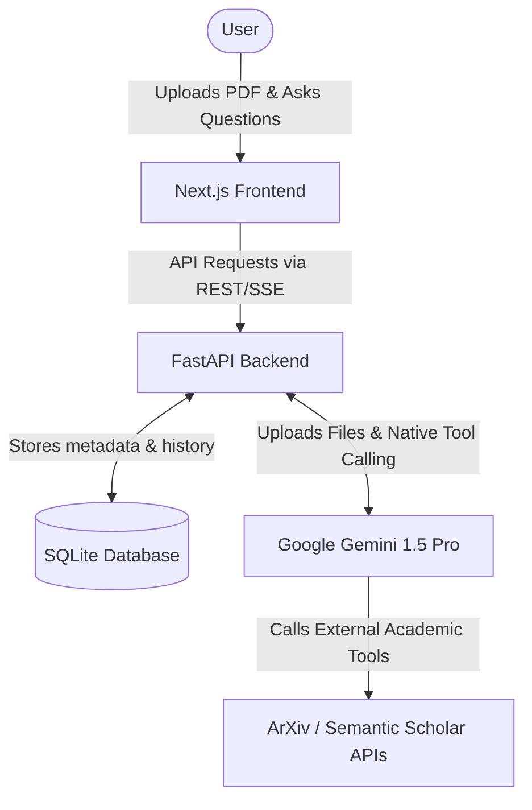

# 🎓 Scientific Paper Review AI System

[](https://github.com/nghon4maeri/reviewer/actions/workflows/ci.yml)

A powerful, full-stack AI system designed to automatically peer-review scientific papers. Inspired by Google's NotebookLM, this application allows users to upload local PDFs and chat with them using native citations, while an autonomous AI Agent critiques the methodology and generates a comprehensive review using specialized academic tools.

## 🚀 Tech Stack
- **Frontend**: Next.js 14, React, Tailwind CSS, Shadcn UI
- **Backend**: Python FastAPI, SQLAlchemy, SQLite
- **AI Engine**: Google Gemini 1.5 Pro (Native File API & Function Calling)
- **Testing & CI**: Pytest, Vitest, GitHub Actions

## 🏗️ Architecture



## 🐳 Quick Start (Docker)

1. Clone the repository and configure your `.env` file at the root:
   ```env
   GEMINI_API_KEY=your_gemini_api_key_here
   ```
2. Start the services using Docker Compose:
   ```bash
   make up
   ```
3. Open `http://localhost:3000` in your browser.

## ⚙️ Manual Setup

If you prefer running without Docker:

### Backend
1. Navigate to the `backend/` directory.
2. Create a virtual environment and install dependencies:
   ```bash
   python -m venv venv
   source venv/bin/activate  # On Windows: venv\Scripts\activate
   pip install -r requirements.txt
   ```
3. Set your `GEMINI_API_KEY` in `backend/.env`.
4. Start the FastAPI server:
   ```bash
   uvicorn main:app --reload
   ```

### Frontend
1. Navigate to the `frontend/` directory.
2. Install dependencies (use legacy peer deps if needed due to Babel conflicts):
   ```bash
   npm install --legacy-peer-deps
   ```
3. Create `.env.local`:
   ```env
   NEXT_PUBLIC_API_URL=http://localhost:8000
   ```
4. Start the Next.js development server:
   ```bash
   npm run dev
   ```

## 🧪 Testing
- **Backend**: `cd backend && pytest`
- **Frontend**: `cd frontend && npm run test`
